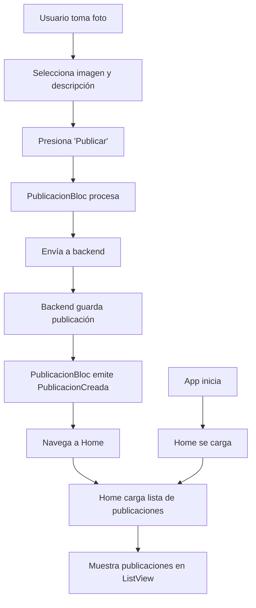

# Diseño de la Funcionalidad: Retorno al Home y Visualización de Publicaciones

## Arquitectura General

La aplicación seguirá un patrón de navegación simple: después de publicar una foto exitosamente, el usuario será redirigido automáticamente a la página principal (Home), donde se mostrarán todas las publicaciones. Al iniciar la aplicación, el Home cargará automáticamente todas las publicaciones disponibles.

## Cambios en el Backend (Java/Spring Boot)

### 1. Nuevo Endpoint para Listar Publicaciones
- **Ruta**: `GET /api/publicaciones`
- **Parámetros de consulta opcionales**:
  - `page` (int, default: 0): Número de página para paginación
  - `size` (int, default: 20): Tamaño de página
- **Respuesta**: Lista de publicaciones con metadatos de usuario y paginación

### 2. DTO de Respuesta para Listado
```java
public class PublicacionListResponse {
    private UUID id;
    private String descripcion;
    private String imagenUrl; // URL de la imagen procesada
    private Double longitud;
    private Double latitud;
    private LocalDateTime fechaCreacion;
    private UsuarioSummary usuario; // DTO simplificado del usuario

    // Getters y setters
}

public class UsuarioSummary {
    private UUID id;
    private String nombre;
    private String avatarUrl;

    // Getters y setters
}
```

### 3. Servicio de Publicaciones
- Agregar método `obtenerPublicaciones(Pageable pageable)` que retorne `Page<Publicacion>` con datos de usuario cargados.

### 4. Controlador Actualizado
```java
@GetMapping
public ResponseEntity<Page<PublicacionListResponse>> listar(
    @RequestParam(defaultValue = "0") int page,
    @RequestParam(defaultValue = "20") int size) {
    Pageable pageable = PageRequest.of(page, size, Sort.by("fechaCreacion").descending());
    return ResponseEntity.ok(publicacionService.obtenerPublicaciones(pageable));
}
```

## Cambios en el Frontend (Flutter)

### 1. Página Home Actualizada
- La página Home (`home_pagina.dart`) se convertirá en un listado de publicaciones.
- Usará un `ListView` para mostrar las publicaciones en tarjetas.
- Implementará pull-to-refresh para recargar la lista.

### 2. Widget de Publicación
```dart
class PublicacionCard extends StatelessWidget {
  final PublicacionListResponse publicacion;

  @override
  Widget build(BuildContext context) {
    return Card(
      child: Column(
        children: [
          Image.network(publicacion.imagenUrl),
          Text(publicacion.descripcion),
          Text('${publicacion.usuario.nombre} - ${publicacion.fechaCreacion}'),
          if (publicacion.longitud != null && publicacion.latitud != null)
            Text('Ubicación: ${publicacion.latitud}, ${publicacion.longitud}'),
        ],
      ),
    );
  }
}
```

### 3. BLoC para Listado de Publicaciones
- Crear `PublicacionesListBloc` con eventos: `CargarPublicaciones`, `RefrescarPublicaciones`
- Estados: `PublicacionesInicial`, `PublicacionesCargando`, `PublicacionesCargadas`, `PublicacionesError`

### 4. Navegación Después de Publicar
- En `PublicacionBloc`, después de `emit(PublicacionCreada())`, agregar navegación:
```dart
emit(PublicacionCreada());
Navigator.of(context).pushReplacementNamed('/home');
```

### 5. Carga Inicial en Home
- En `home_pagina.dart`, al inicializar, disparar `CargarPublicaciones` en el BLoC.

## Diagrama de Flujo



## Consideraciones Técnicas

- **Paginación**: Implementar carga infinita o paginación para manejar muchas publicaciones.
- **Imágenes**: Asegurar que las URLs de imágenes sean accesibles desde el frontend.
- **Cache**: Considerar cache local para publicaciones recientes.
- **Errores**: Manejar errores de red tanto en carga como en publicación.
- **Permisos**: Verificar permisos de ubicación antes de intentar obtener coordenadas.

Esta arquitectura asegura una experiencia fluida donde el usuario siempre regresa al punto central de la aplicación después de publicar, y puede ver todas las publicaciones de la comunidad.