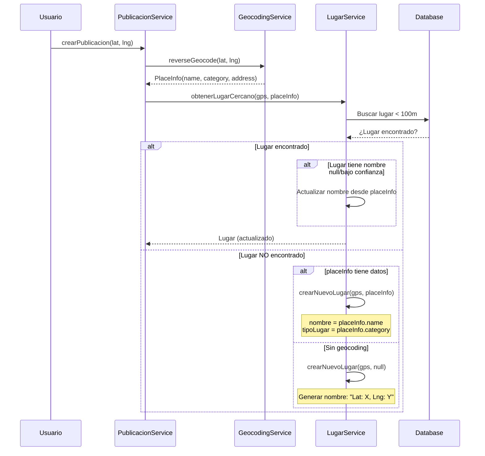

# Plan de Implementación: Obtención del Nombre del Lugar desde Coordenadas

## Resumen Ejecutivo

**Problema identificado:** El sistema ya calcula el `Point` con las coordenadas y tiene un servicio de geocodificación con Mapbox, pero el nombre del lugar obtenido del reverse geocoding **no se está utilizando** para actualizar o crear el [`Lugar`](src/main/java/com/worldrank/app/lugar/domain/Lugar.java:1).

**Solución:** Modificar el flujo para que la información del geocoding se passe al [`LugarService`](src/main/java/com/worldrank/app/lugar/service/LugarService.java:1) y se use para nombrar los lugares, con un fallback a nombres genéricos cuando no hay datos de geocoding.

---

## 1. Flujo Actual vs. Flujo Propuesto

### Flujo Actual (Problemático)

```mermaid
sequenceDiagram
    participant US as Usuario
    participant PS as PublicacionService
    participant GS as GeocodingService
    participant LS as LugarService
    participant DB as Database

    US->>PS: crearPublicacion(lat, lng)
    PS->Geocode(lat, lng)
    GS>GS: reverse-->>PS: PlaceInfo(name, category)
    
    Note over PS: nombreLugar = place.name()<br/>Pero NO se usa!
    
    PS->>LS: obtenerLugarCercano(gps)
    LS->>DB: Buscar lugar < 100m
    DB-->>LS: ¿Lugar encontrado?
    
    alt Lugar NO encontrado
        LS->>LS: crearNuevoLugar(gps)
        Note over LS: nombre = null<br/>tipoLugar = null
    end
    
    LS-->>PS: Lugar (sin nombre)
```

### Flujo Propuesto



---

## 2. Cambios Requeridos por Archivo

### 2.1 [`PlaceInfo.java`](src/main/java/com/worldrank/app/geocoding/PlaceInfo.java:1) - Añadir campo address

**Cambio:** El campo `address` ya existe pero no se está usando. Verificar que se persista correctamente.

```java
public record PlaceInfo(
    String name,
    String address,      // YA EXISTE - verificar que se use
    double latitude,
    double longitude,
    String category     // Tipo de lugar (poi, address, locality, etc.)
) {
    // Método auxiliar para verificar si es un lugar conocido
    public boolean esLugarConocido() {
        return name != null && !name.isEmpty() && 
               !name.equalsIgnoreCase("Unknown Place");
    }
}
```

---

### 2.2 [`LugarService.java`](src/main/java/com/worldrank/app/lugar/service/LugarService.java:1) - Modificar métodos

**Cambios:**

1. Modificar [`obtenerLugarCercano()`](src/main/java/com/worldrank/app/lugar/service/LugarService.java:46) para aceptar `PlaceInfo`

2. Modificar [`crearNuevoLugar()`](src/main/java/com/worldrank/app/lugar/service/LugarService.java:54) para usar `PlaceInfo`

3. Añadir lógica para actualizar lugares existentes que necesiten nombre

```java
@Service
public class LugarService {

    // ... constructores y dependencias ...

    /**
     * Obtiene un lugar cercano o crea uno nuevo con información de geocoding
     */
    public Lugar obtenerLugarCercano(Point point, PlaceInfo placeInfo) {
        Optional<Lugar> lugarExistente = lugarRepository.findLugarCercano(point, 100);
        
        if (lugarExistente.isPresent()) {
            Lugar lugar = lugarExistente.get();
            
            // Si el lugar no tiene nombre o tiene baja confianza, actualizarlo
            if (debeActualizarNombre(lugar, placeInfo)) {
                actualizarLugarConGeocoding(lugar, placeInfo);
            }
            return lugar;
        }
        
        // Crear nuevo lugar
        return crearNuevoLugar(point, placeInfo);
    }
    
    /**
     * Versión original para compatibilidad
     */
    public Lugar obtenerLugarCercano(Point point) {
        return obtenerLugarCercano(point, null);
    }

    /**
     * Determina si el lugar debe ser actualizado con datos del geocoding
     */
    private boolean debeActualizarNombre(Lugar lugar, PlaceInfo placeInfo) {
        if (placeInfo == null || !placeInfo.esLugarConocido()) {
            return false;
        }
        
        // Actualizar si:
        // 1. El lugar no tiene nombre (auto-generado)
        // 2. El lugar tiene baja confianza (< 50)
        // 3. El nuevo dato tiene mayor confianza
        return (lugar.getNombre() == null || 
                lugar.getNombre().startsWith("Lat:") ||
                lugar.getConfianza() < 50) &&
               lugar.getConfianza() < 80;
    }

    /**
     * Actualiza un lugar existente con datos del geocoding
     */
    private void actualizarLugarConGeocoding(Lugar lugar, PlaceInfo placeInfo) {
        lugar.setNombre(placeInfo.name());
        if (placeInfo.category() != null && lugar.getTipoLugar() == null) {
            lugar.setTipoLugar(placeInfo.category());
        }
        lugar.setConfianza(calcularConfianza(placeInfo));
        // El lugar deja de ser auto-generado si tiene nombre real
        if (placeInfo.esLugarConocido()) {
            lugar.setAutoGenerado(false);
        }
    }

    /**
     * Crea un nuevo lugar con datos de geocoding o nombre genérico
     */
    private Lugar crearNuevoLugar(Point point, PlaceInfo placeInfo) {
        String nombre;
        String tipoLugar;
        int confianza;
        boolean autoGenerado;

        if (placeInfo != null && placeInfo.esLugarConocido()) {
            // Usar datos del geocoding
            nombre = placeInfo.name();
            tipoLugar = placeInfo.category();
            confianza = calcularConfianza(placeInfo);
            autoGenerado = false;
        } else {
            // Generar nombre basado en coordenadas
            nombre = generarNombreCoordenadas(point);
            tipoLugar = placeInfo != null ? placeInfo.category() : "desconocido";
            confianza = 10;
            autoGenerado = true;
        }

        return Lugar.builder()
            .id(UUID.randomUUID())
            .nombre(nombre)
            .tipoLugar(tipoLugar)
            .puntajeBase(100)  // Valor por defecto
            .geom(point)
            .radioMetros(30)
            .cantidadVisitas(0)
            .autoGenerado(autoGenerado)
            .fechaCreacion(LocalDateTime.now())
            .confianza(confianza)
            .build();
    }

    /**
     * Genera un nombre basado en coordenadas cuando no hay geocoding
     */
    private String generarNombreCoordenadas(Point point) {
        double lat = Math.round(point.getY() * 10000.0) / 10000.0;
        double lng = Math.round(point.getX() * 10000.0) / 10000.0;
        return String.format("Lat: %.4f, Lng: %.4f", lat, lng);
    }

    /**
     * Calcula la confianza basada en la calidad del geocoding
     */
    private int calcularConfianza(PlaceInfo placeInfo) {
        if (placeInfo == null) return 10;
        
        // Mapbox devuelve diferentes tipos con diferentes confiabilidades
        int baseConfianza = switch (placeInfo.category()) {
            case "poi" -> 80;           // Punto de interés conocido
            case "address" -> 70;       // Dirección específica
            case "locality" -> 60;      // Barrio/ciudad
            case "place" -> 50;         // Ciudad/población
            case "region" -> 30;        // Región/estado
            default -> 40;
        };
        
        return baseConfianza;
    }
}
```

---

### 2.3 [`PublicacionService.java`](src/main/java/com/worldrank/app/publicacion/service/PublicacionService.java:1) - Usar la nueva lógica

**Cambios en [`crearPublicacion()`](src/main/java/com/worldrank/app/publicacion/service/PublicacionService.java:67):**

```java
public PublicacionResponse crearPublicacion(
        Usuario usuario,
        CrearPublicacionRequest request) {
    // ... código existente hasta extracción de coordenadas ...

    // 4️⃣ Crear punto GPS (lng, lat)
    Point gps = geometryFactory.createPoint(
            new Coordinate(longitud.doubleValue(), latitud.doubleValue())
    );
    gps.setSRID(4326);

    // 5️⃣ Obtener información del lugar mediante geocoding
    PlaceInfo placeInfo = null;
    try {
        placeInfo = geocodingService.reverseGeocode(latitud, longitud);
        if (placeInfo != null) {
            System.out.println("Geocoding: " + placeInfo.name() + " (" + placeInfo.category() + ")");
        }
    } catch (Exception e) {
        System.out.println("Error en geocoding: " + e.getMessage());
    }

    // 6️⃣ Obtener o crear lugar con información del geocoding
    Lugar lugar = lugarService.obtenerLugarCercano(gps, placeInfo);
    System.out.println("Lugar: " + lugar.getId() + " - " + lugar.getNombre());

    // ... resto del código ...
}
```

---

## 3. Lógica de Nombres Genéricos

Cuando **NO hay geocoding** (lugar desconocido), se generará un nombre basado en:

| Escenario | Formato del Nombre | Ejemplo |
|-----------|-------------------|---------|
| Coordenadas válidas | `Lat: {lat}, Lng: {lng}` | `Lat: 40.4168, Lng: -3.7038` |
| Coordenadas inválidas/null | `Ubicación desconocida` | `Ubicación desconocida` |

**Mejoras opcionales:**
- Si el `tipoLugar` viene vacío, usar `"lugar"` como predeterminado
- Añadir sufijo con el tipo si está disponible: `Lat: 40.4168, Lng: -3.7038 (poi)`

---

## 4. Resumen de Archivos a Modificar

| Archivo | Tipo de Cambio | Descripción |
|---------|----------------|-------------|
| `src/main/java/com/worldrank/app/geocoding/PlaceInfo.java` | Modificación | Añadir método `esLugarConocido()` |
| `src/main/java/com/worldrank/app/lugar/service/LugarService.java` | Modificación | Nueva lógica con `PlaceInfo` |
| `src/main/java/com/worldrank/app/publicacion/service/PublicacionService.java` | Modificación | Pasar `PlaceInfo` a `obtenerLugarCercano()` |

---

## 5. Consideraciones de Compatibilidad

1. **Retrocompatibilidad:** El método `obtenerLugarCercano(Point)` sigue funcionando igual
2. **Base de datos:** No requiere migraciones, solo actualización de código
3. **Mapbox Token:** Ya configurado en `application.properties`

---

## 6. Próximos Pasos

1. [ ] Revisar y aprobar este plan
2. [ ] Cambiar a modo `code` para implementar los cambios
3. [ ] Escribir tests para la nueva funcionalidad
4. [ ] Verificar que compila correctamente
5. [ ] Probar con datos reales
