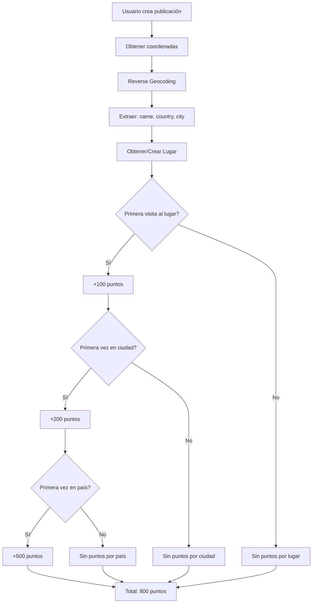

# Plan: Sistema de País y Ciudad con Puntaje por Nuevos Descubrimientos

## Resumen Ejecutivo

**Objetivo:** Extraer país y ciudad de las coordenadas mediante geocoding, almacenarlos en la base de datos, e implementar un sistema de puntaje adicional por visitar países y ciudades nuevas.

**Hallazgo:** El [`MapboxGeocodingService`](src/main/java/com/worldrank/app/geocoding/MapboxGeocodingService.java:1) actual solo extrae `name`, `address`, `lat`, `lon`, `category`. Necesita extender el parsing para obtener `context` que contiene `country` y `city`.

---

## 1. Análisis de Opciones de Diseño

### Opción A: Agregar campos a tabla `lugar`

| Aspecto | Detalle |
|---------|---------|
| **Tablas** | Solo modificar `lugar` (agregar `pais`, `ciudad`) |
| **Pros** | Simple, sin nuevas tablas, cambio mínimo |
| **Contras** | No permite contar ciudades únicas por usuario fácilmente, datos duplicados |

### Opción B: Nuevas tablas `pais` y `ciudad` (Recomendada)

| Aspecto | Detalle |
|---------|---------|
| **Tablas** | `region` (o `pais_ciudad`), `usuario_region` |
| **Pros** | Normalizado, tracking de regiones únicas, escalable |
| **Contras** | Más complejo, requiere más lógica |

### Opción C: Tabla `region` combinada

| Aspecto | Detalle |
|---------|---------|
| **Tablas** | `region` con `tipo` (PAIS/CIUDAD), `region_padre` |
| **Pros** | Estructura jerárquica, flexible |
| **Contras** | Más complejo, overkill para el caso |

---

## 2. Recomendación: Opción A Simplificada

Para este caso de uso, recomiendo **agregar campos a la tabla `lugar`** con una tabla de tracking para usuarios:

```
┌─────────────────────────────────────────────────────────────┐
│                        usuario                              │
├─────────────────────────────────────────────────────────────┤
│ id, email, username, password, pais_origen                  │
└─────────────────────────────────────────────────────────────┘
                              │
                              ▼
┌─────────────────────────────────────────────────────────────┐
│                           lugar                              │
├─────────────────────────────────────────────────────────────┤
│ id, nombre, tipo_lugar, pais, ciudad, geom, ...            │
└─────────────────────────────────────────────────────────────┘
                              │
                              ▼
┌─────────────────────────────────────────────────────────────┐
│                    usuario_region_visita                    │
├─────────────────────────────────────────────────────────────┤
│ id_usuario, id_lugar (representa region), tipo (PAIS/CIUDAD)│
│ fecha_primera_visita, puntos_obtenidos                      │
└─────────────────────────────────────────────────────────────┘
```

**Rationale:**
1. El usuario quiere puntaje por **país nuevo** y **ciudad nueva**
2. No necesita un catálogo de países/ciudades para explorar
3. La tabla `lugar` ya agrupa múltiples puntos cercanos
4. La tabla de tracking permite calcular regiones únicas por usuario

---

## 3. Arquitectura Propuesta

### 3.1 Nuevas Entidades

```java
// src/main/java/com/worldrank/app/region/domain/Region.java
@Entity
@Table(name = "region")
public class Region {
    @Id
    @GeneratedValue
    private UUID id;
    
    private String nombre;
    private String tipo; // "PAIS" o "CIUDAD"
    private String codigo; // ISO para países (ES, MX, AR)
    
    // Para ciudades: referencia al país
    @ManyToOne
    @JoinColumn(name = "id_pais")
    private Region pais;
    
    @Column(columnDefinition = "geography(Point,4326)")
    private Point centro;
}

// src/main/java/com/worldrank/app/region/domain/UsuarioRegion.java
@Entity
@Table(name = "usuario_region")
public class UsuarioRegion {
    @Id
    @GeneratedValue
    private UUID id;
    
    @ManyToOne
    @JoinColumn(name = "id_usuario")
    private Usuario usuario;
    
    @ManyToOne
    @JoinColumn(name = "id_region")
    private Region region;
    
    private LocalDateTime primeraVisita;
    private int puntosObtenidos;
}
```

### 3.2 Modificaciones a Entidades Existentes

```java
// src/main/java/com/worldrank/app/lugar/domain/Lugar.java
public class Lugar {
    // ... campos existentes ...
    
    // Nuevos campos para país/ciudad
    private String pais;
    private String ciudad;
    
    // Opcional: referencia a Region si usamos la opción B
    @ManyToOne
    @JoinColumn(name = "id_region")
    private Region region;
}
```

---

## 4. Cambios en Geocoding

### 4.1 Actualizar [`PlaceInfo.java`](src/main/java/com/worldrank/app/geocoding/PlaceInfo.java:1)

```java
public record PlaceInfo(
    String name,
    String address,
    double latitude,
    double longitude,
    String category,
    String country,      // NUEVO
    String city,         // NUEVO
    String countryCode   // NUEVO (ISO code)
) {
    public boolean esLugarConocido() {
        return name != null && !name.isEmpty() && 
               !name.equalsIgnoreCase("Unknown Place");
    }
}
```

### 4.2 Actualizar [`MapboxGeocodingService.java`](src/main/java/com/worldrank/app/geocoding/MapboxGeocodingService.java:1)

El API de Mapbox devuelve un array `context` con country y city:

```json
{
  "features": [{
    "text": "Puerta del Sol",
    "place_name": "Puerta del Sol, Centro, Madrid, Comunidad de Madrid 28013, España",
    "center": [-3.7024, 40.4168],
    "context": [
      {"id": "country.123", "text": "España"},
      {"id": "region.456", "text": "Comunidad de Madrid"},
      {"id": "place.789", "text": "Madrid"},
      {"id": "locality.111", "text": "Centro"}
    ]
  }]
}
```

```java
private List<PlaceInfo> parseResponse(String url) {
    // ... código existente ...
    for (JsonNode feature : features) {
        // ... parsing existente ...
        
        // NUEVO: Extraer country y city del context
        String country = null;
        String city = null;
        String countryCode = null;
        
        JsonNode context = feature.path("context");
        for (JsonNode ctx : context) {
            String id = ctx.path("id").asText();
            String text = ctx.path("text").asText();
            
            if (id.startsWith("country.")) {
                country = text;
                // Obtener código ISO del context de country
                JsonNode shortCode = ctx.path("short_code");
                countryCode = shortCode.asText(); // "es"
            }
            if (id.startsWith("place.") || id.startsWith("locality.")) {
                city = text;
            }
        }
        
        places.add(new PlaceInfo(name, address, lat, lon, category, country, city, countryCode));
    }
    return places;
}
```

---

## 5. Sistema de Puntaje Propuesto

### 5.1 Puntos por Región Nueva

| Acción | Puntos |
|--------|--------|
| Primera visita a un **país** nuevo | 500 |
| Primera visita a una **ciudad** nueva | 200 |
| Primera visita a un **lugar** nuevo | 100 (existente) |

### 5.2 Modificar [`PuntajeService.java`](src/main/java/com/worldrank/app/puntaje/service/PuntajeService.java:1)

```java
@Service
public class PuntajeService {

    private static final int PUNTOS_LUGAR_NUEVO = 100;
    private static final int PUNTOS_CIUDAD_NUEVA = 200;
    private static final int PUNTOS_PAIS_NUEVO = 500;

    private final RegionService regionService;

    public PuntajeService(RegionService regionService) {
        this.regionService = regionService;
    }

    public ResultadoPuntaje calcularPuntajeCompleto(
            Usuario usuario,
            Lugar lugar,
            boolean esPrimeraVisitaLugar,
            int visitasLugar
    ) {
        ResultadoPuntaje resultado = new ResultadoPuntaje();
        
        // 1. Puntos por lugar
        if (esPrimeraVisitaLugar) {
            resultado.addPuntos(PUNTOS_LUGAR_NUEVO);
        }
        
        // 2. Puntos por ciudad nueva
        boolean esCiudadNueva = regionService.esPrimeraVisitaCiudad(usuario, lugar.getCiudad());
        if (esCiudadNueva) {
            resultado.addPuntos(PUNTOS_CIUDAD_NUEVA);
            resultado.addRegionDescubierta("CIUDAD", lugar.getCiudad());
        }
        
        // 3. Puntos por país nuevo
        boolean esPaisNuevo = regionService.esPrimeraVisitaPais(usuario, lugar.getPais());
        if (esPaisNuevo) {
            resultado.addPuntos(PUNTOS_PAIS_NUEVO);
            resultado.addRegionDescubierta("PAIS", lugar.getPais());
        }
        
        return resultado;
    }
}

public class ResultadoPuntaje {
    private int totalPuntos;
    private List<String> regionesDescubiertas;
    
    public void addPuntos(int puntos) { this.totalPuntos += puntos; }
    public void addRegionDescubierta(String tipo, String nombre) { 
        this.regionesDescubiertas.add(tipo + ": " + nombre);
    }
}
```

---

## 6. Nuevos Servicios

```java
// src/main/java/com/worldrank/app/region/service/RegionService.java
@Service
public class RegionService {

    private RegionRepository regionRepository;
    private UsuarioRegionRepository usuarioRegionRepository;

    public Region obtenerOCrearPais(String nombre, String codigoIso) {
        return regionRepository.findByNombreAndTipo(nombre, "PAIS")
            .orElseGet(() -> {
                Region pais = Region.builder()
                    .nombre(nombre)
                    .codigo(codigoIso)
                    .tipo("PAIS")
                    .build();
                return regionRepository.save(pais);
            });
    }

    public Region obtenerOCrearCiudad(String nombre, Region pais) {
        return regionRepository.findByNombreAndPais(nombre, pais)
            .orElseGet(() -> {
                Region ciudad = Region.builder()
                    .nombre(nombre)
                    .pais(pais)
                    .tipo("CIUDAD")
                    .build();
                return regionRepository.save(ciudad);
            });
    }

    public boolean esPrimeraVisitaCiudad(Usuario usuario, String ciudadNombre) {
        return !usuarioRegionRepository.existsByUsuarioAndRegionNombre(usuario, ciudadNombre);
    }

    public boolean esPrimeraVisitaPais(Usuario usuario, String paisNombre) {
        return !usuarioRegionRepository.existsByUsuarioAndRegionPais(usuario, paisNombre);
    }

    public void registrarPrimeraVisita(Usuario usuario, Region region, int puntos) {
        UsuarioRegion usuarioRegion = UsuarioRegion.builder()
            .usuario(usuario)
            .region(region)
            .primeraVisita(LocalDateTime.now())
            .puntosObtenidos(puntos)
            .build();
        usuarioRegionRepository.save(usuarioRegion);
    }
}
```

---

## 7. Modificaciones en [`LugarService`](src/main/java/com/worldrank/app/lugar/service/LugarService.java:1)

```java
public Lugar crearLugar(Point point, PlaceInfo placeInfo) {
    String nombre = placeInfo != null ? placeInfo.name() : generarNombreCoordenadas(point);
    String pais = placeInfo != null ? placeInfo.country() : null;
    String ciudad = placeInfo != null ? placeInfo.city() : null;
    
    return Lugar.builder()
        .nombre(nombre)
        .tipoLugar(placeInfo != null ? placeInfo.category() : "desconocido")
        .pais(pais)           // NUEVO
        .ciudad(ciudad)       // NUEVO
        .geom(point)
        .radioMetros(30)
        .cantidadVisitas(0)
        .autoGenerado(placeInfo == null || !placeInfo.esLugarConocido())
        .fechaCreacion(LocalDateTime.now())
        .confianza(calcularConfianza(placeInfo))
        .build();
}
```

---

## 8. Resumen de Archivos a Modificar/Crear

### Nuevos Archivos
| Archivo | Descripción |
|---------|-------------|
| `src/main/java/com/worldrank/app/region/domain/Region.java` | Entidad para países y ciudades |
| `src/main/java/com/worldrank/app/region/domain/UsuarioRegion.java` | Tracking de visitas a regiones |
| `src/main/java/com/worldrank/app/region/repository/RegionRepository.java` | Repositorio de regiones |
| `src/main/java/com/worldrank/app/region/repository/UsuarioRegionRepository.java` | Repositorio de tracking |
| `src/main/java/com/worldrank/app/region/service/RegionService.java` | Lógica de regiones |
| `src/main/java/com/worldrank/app/puntaje/domain/ResultadoPuntaje.java` | DTO para resultado de puntaje |

### Archivos a Modificar
| Archivo | Cambio |
|---------|--------|
| `src/main/java/com/worldrank/app/geocoding/PlaceInfo.java` | Añadir country, city, countryCode |
| `src/main/java/com/worldrank/app/geocoding/MapboxGeocodingService.java` | Extraer context para country/city |
| `src/main/java/com/worldrank/app/lugar/domain/Lugar.java` | Añadir campos pais, ciudad |
| `src/main/java/com/worldrank/app/lugar/service/LugarService.java` | Usar nuevos campos del geocoding |
| `src/main/java/com/worldrank/app/puntaje/service/PuntajeService.java` | Añadir lógica de puntaje por región |
| `src/main/java/com/worldrank/app/visita/service/VisitaService.java` | Integrar nuevo sistema de puntaje |

---

## 9. Diagrama de Flujo de Puntaje



---

## 10. Consideraciones

1. **Backward Compatibility:** Mantener compatibilidad con lugares existentes (pais/ciudad null)
2. **Migración BD:** ALTER TABLE para añadir campos a `lugar`
3. **Puntaje único:** Una vez descobertos país/ciudad, no dar puntos adicionales
4. **Mapbox Token:** Ya configurado, no necesita cambios

---

## 11. Próximos Pasos

1. [ ] Revisar y aprobar este plan
2. [ ] Cambiar a modo `code` para implementar
3. [ ] Actualizar MapboxGeocodingService para extraer country/city
4. [ ] Modificar Lugar con nuevos campos
5. [ ] Crear entidades Region y UsuarioRegion
6. [ ] Implementar RegionService
7. [ ] Extender PuntajeService
8. [ ] Actualizar VisitaService
9. [ ] Escribir tests
10. [ ] Verificar compilación
